Moving Usage logs to Log Analytics

Scenario: Customers would like to want their usage data to be moved to
Log Analytics.

Pre-requisites:

-   Visual Studio 2017 (Download from
    [here](https://visualstudio.microsoft.com/vs/whatsnew/).)

-   Azure Functions and WebJobs Tools (Download from
    [here](https://marketplace.visualstudio.com/items?itemName=VisualStudioWebandAzureTools.AzureFunctionsandWebJobsTools))

Step 1: Create a Log Analytics workspace in the subscription you want to
see the usage for

Go to the portal and search for Log Analytics in All services. Once you are in Log Analytics,
Click Add button and fill the Workspace details.
<https://ms.portal.azure.com/#blade/HubsExtension/Resources/resourceType/Microsoft.OperationalInsights%2Fworkspaces>

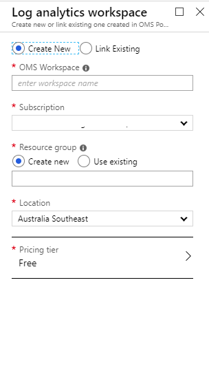

2\. Enable SqlAuditLogs on the Sql Server Database on the subscription
you want. You can do that by going to the SQL Database and to Diagnostic settings and click "Add diagnostic setting". 
Here you can see the workspace you created in previous step.

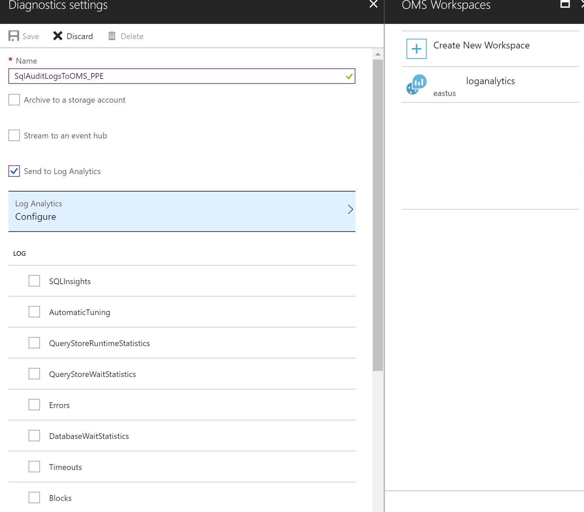

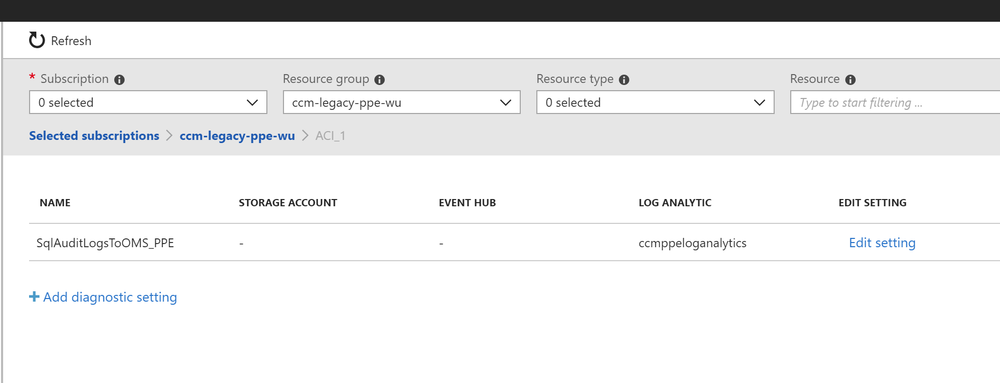

Once the sql audit logs are being enabled to go into Log Analytics, lets
work on moving the usage data to Log Analytics.

4. Get the code from Git Hub and build the application. There are 4
projects in that solution. Function App is one way of invoking the code that is in a class library.
You can also use webjobs or cloud services. We are using Function app here.
This function app runs every 4 hours. You can change the frequency by changing the cron
expression. This if found in UsageToOMS.cs file.

public static void Run([TimerTrigger("0 0 3,7,11,15,19,23 * * *")]TimerInfo myTimer, TraceWriter log)   

The Function App UsageToOMSFunc needs the following secrets to be
created in KeyVault.

1.  omsworkspaceid

    i.  The oms workspaceId can be found in the advanced settings of the
        Log Analytics

2.  omsworkspacekey

    ii. This is the Primary key that can be found in the advanced
        settings of Log Analytics

3.  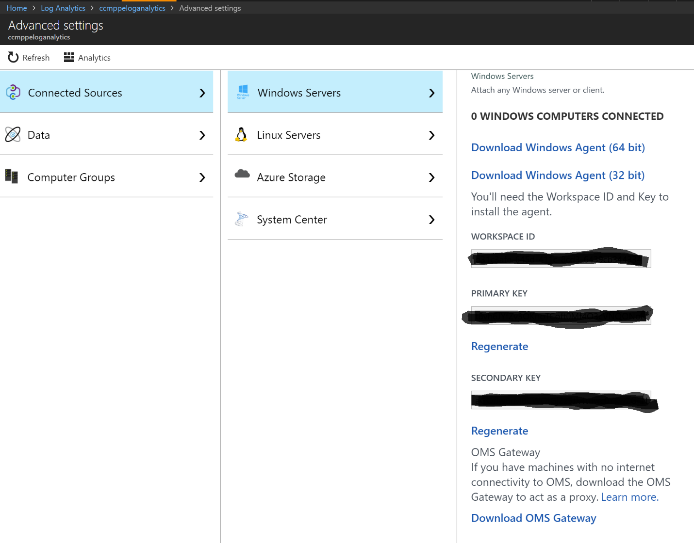

4.  Open a new browser and go to the KeyVault where you would want to
    store and create the secrets.
5.  Once its created copy the Keyvault url and paste in the
    localsettings.json file in UsageToOMSFunc project. The following settings are needed in localsettings.json.
    LocalSettings file is only for local debugging.The same settings need to be provided in App Settings of the function in the portal.
    {
      "IsEncrypted": false,
        "Values": {
        "AzureWebJobsStorage": "UseDevelopmentStorage=true",
        "AzureWebJobsDashboard": "",
        "KeyVaultURL": "",
        "accesstokensecretname": "",
        "enrollmentnumber":  ""       
        "azurebillingurl": "https://consumption.azure.com/v2/enrollments",
        "omsingestionapi": "https://{0}.ods.opinsights.azure.com/api/logs?api-version=2016-04-01"
        }
    }

    For AzureWebJobsDashboard setting to work locally, run the storage emulator. Instructions are found here.
    https://docs.microsoft.com/en-us/azure/storage/common/storage-use-emulator
    
6.  Now let's publish the Function App to Azure.

7. Open the project in VS2017 and find the UsageToOMSFunc project.

    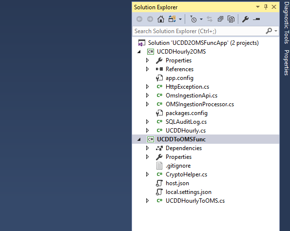

8. Right click on the project and hit Publish. We first need to create
    a profile which has the subscription details, Resource Group,
    Storage Account and what APP Service Plan you want to use.

   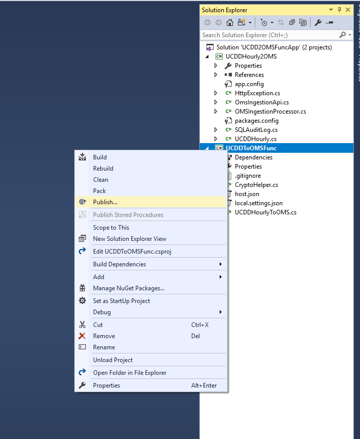

10. Click "Create new profile"

11. Select Create new Azure Function App

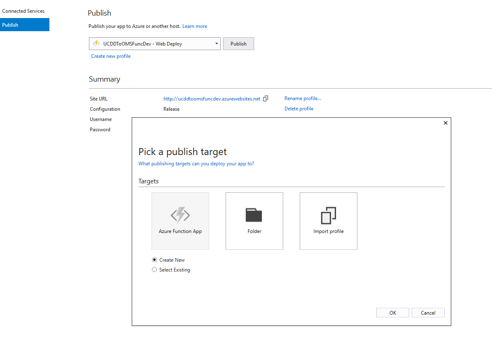

12. Give an appropriate name and select the subscription where it has to
    run.

13. 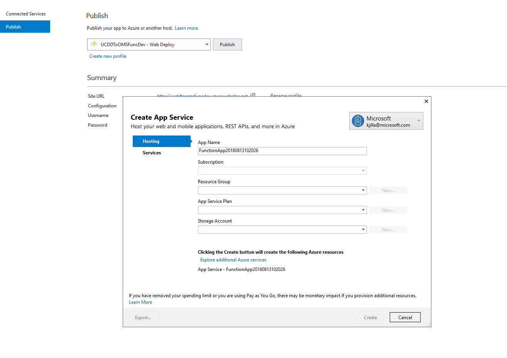

14. Select the right App Service Plan.

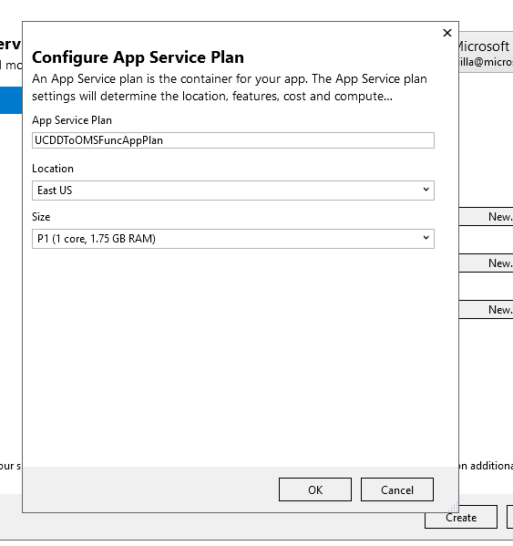

15. Hit Create

16. 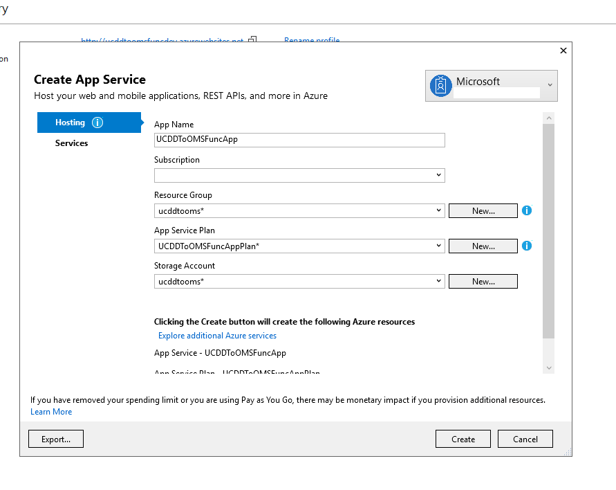

17. It starts deploying the host services the Function App needs.

    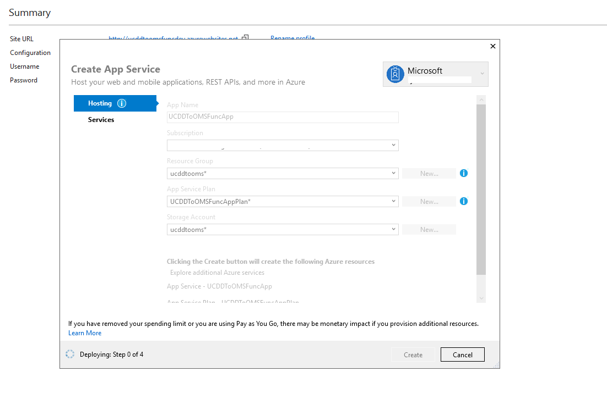

    Once deployment is completed you should be able to see the App
    Service and the FuncApp that got created. The function App is still
    empty, and no functions are deployed. You can search in the
    subscription for resource type "Function Apps"

    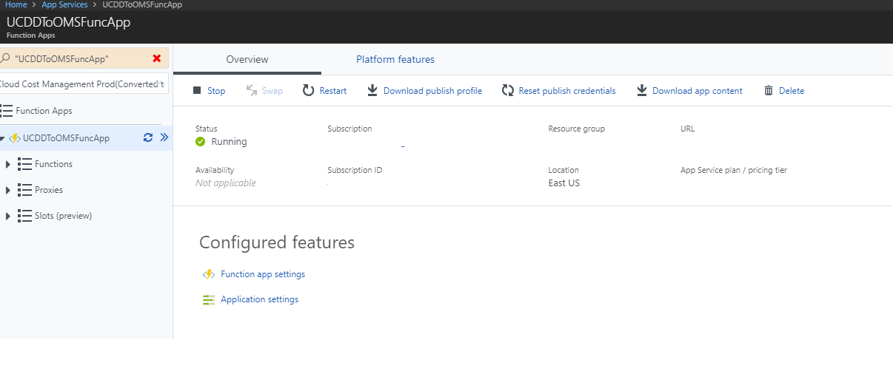

    Now we need to go the App Settings in the portal for that Function
    App. Whatever settings we have in localsettings.json need to be
    copied to App Settings. 
    
    Next we need to enable Managed Service Identity to give Azure
    Identity to this Func App. Go to Platform Features and find

    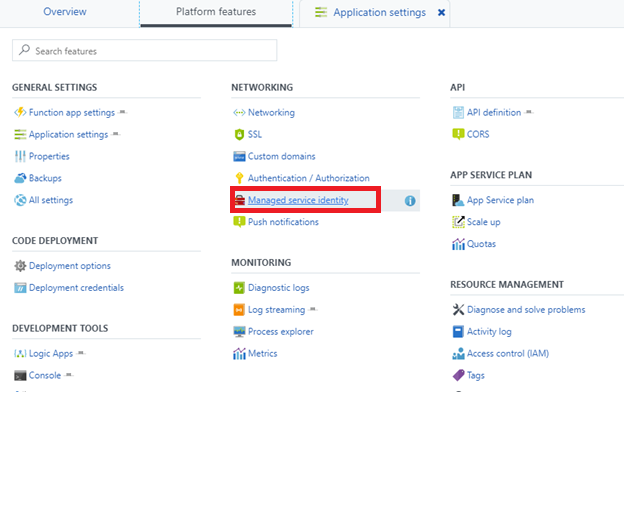

    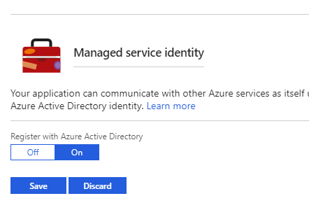

    Hit Save.

    Now we need to go to the Keyvault where we stored our secrets and
    give this newly created MSI of Func App access to secrets.

    Go to KeyVault -> Access policies and click Add New

    

    And in Select Prinicpal search for Function App.

    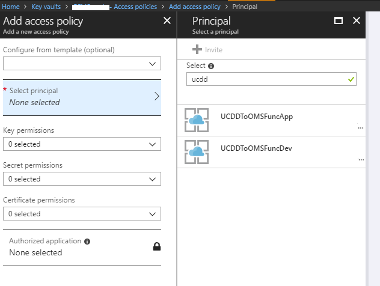

    And select Get and List in Secret permissions.

    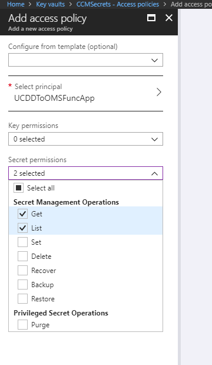

    And don't forget to save it.

    Now the Function App has access to Keyvault.

    Now let's enable App Insights for logging so that we can see the
    logs. Go to all Resources in azure portal home page and search for
    "Application Insights". Pick the correct the subscription and create
    new

    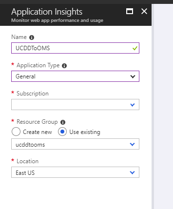

    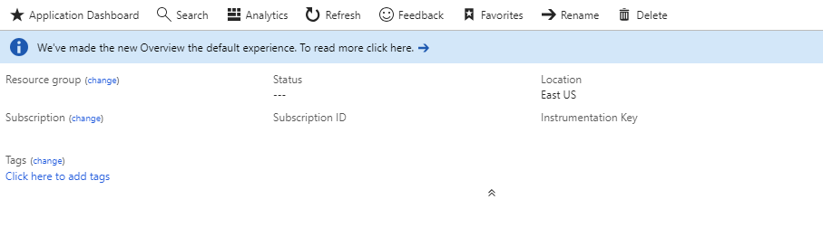

    Once created click on the overview and get the instrumentation key
    and save it somewhere.

    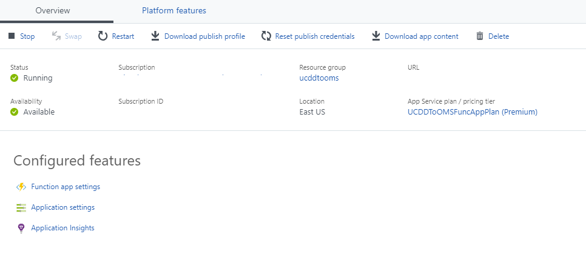

    Now we must provide this instrumentation key in the App Settings of
    the FuncApp.

Add this as setting name "APPINSIGHTS\_INSTRUMENTATIONKEY" and
instrumentation key which you copied earlier. And Save the App Settings.
After few seconds you should see Application Insights in Configured
features.

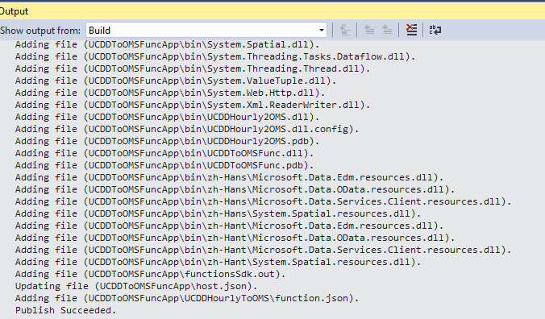

Now that the Host is setup and Keyvault access is granted lets deploy
the code from VS2017. Make sure you build the project in release mode
and right click on publish and select the profile which we created and
click Publish. You should see the status in Output window

Now you should see the function under Functions. If you want to see the
logs, go to the Monitor tab and see the runs.

After a successful run go to your log Analytics and under Custom logs
you should see "Usage_CL" table. To get the latest data there is a function code in VersioningFunction.txt file.
